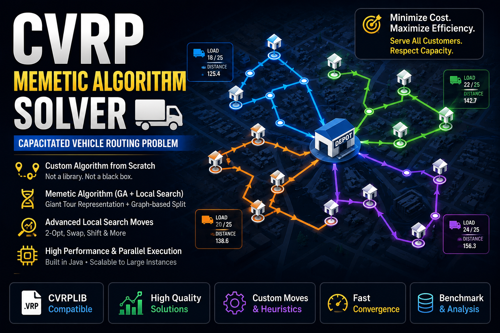

# Heuristic CVRP Solver (Memetic / Genetic Algorithm)



This project solves **Capacitated Vehicle Routing Problem (CVRP)** instances using a **Memetic Algorithm** (Genetic Algorithm + Local Search), with instances taken from **CVRPLIB**.

The solver is **CVRP-native** (not a TSP wrapper): it uses a **giant tour representation** combined with a **graph-based splitting procedure** to generate feasible vehicle routes under capacity constraints, and applies rich intra- and inter-route local search moves.


Reference: CVRPLIB – http://vrp.atd-lab.inf.puc-rio.br/index.php/en/

---

## Problem definition (CVRP)

- Given:
  - A depot
  - A set of customers with demands
  - Vehicle capacity Q
  - Symmetric distance matrix
- Objective:
  - Minimize total routing cost
  - Serve all customers exactly once
  - Each route starts and ends at the depot
  - Vehicle capacity constraints must be respected

---

## Project structure

```
HEURISTICCVRP
├── Algorithm/            # Solver source and CVRPLIB instances
│   ├── CVRPLib/          # CVRPLIB instances (.vrp)
│   ├── Data/             # Algorithm.Data package
│   │   ├── InputData.java
│   │   └── Edge.java
│   ├── Metaheuristics/   # Algorithm.Metaheuristics package
│   │   ├── MetaHeuristic.java
│   │   └── GeneticAlgorithm.java
│   ├── Solution/         # Algorithm.Solution package
│   │   ├── GiantTour.java
│   │   ├── Route.java
│   │   ├── Solution.java
│   │   ├── AuxiliaryGraph.java
│   │   ├── AuxiliaryGraphNode.java
│   │   ├── Move.java
│   │   └── LSM/          # Algorithm.Solution.LSM package
│   │       ├── _2Opt.java
│   │       ├── Swap.java
│   │       ├── LeftShift.java
│   │       ├── RightShift.java
│   │       └── LocalSearchMove.java
│   ├── main.java         # Entry point (single instance run)
│   └── benchmark.java    # Entry point (batch run + .csv benchmark gap)
├── Web/                  # landing page + web.server package
│   ├── server/           # web.server package (JDK HttpServer, no dependencies)
│   │   ├── Server.java     # Bootstrap + route table
│   │   ├── Http.java       # HTTP/SSE transport helpers
│   │   ├── Instances.java  # Read-only CVRPLIB dataset access
│   │   └── Solver.java     # /api/solve (SSE) and /api/stop
│   ├── index.html
│   ├── app.js
│   └── styles.css
└── profile.jpg           # Author profile image
```

---

## Algorithm overview

### 1. Representation: Giant Tour

- Each individual is a **permutation of all customers** (giant tour, no depot).
- No feasibility is enforced at chromosome level.

### 2. Graph-based split (CVRP decoding)

- A **directed auxiliary graph** is built from the giant tour.
- Nodes represent customer positions.
- Edges represent feasible routes respecting vehicle capacity.
- Edge cost = routing cost of the corresponding segment.
- **Shortest path** from start to end gives the optimal split.

This guarantees:
- Capacity feasibility
- Optimal route partitioning for a given giant tour

---

## Genetic Algorithm (Memetic framework)

Implemented in `Algorithm/Metaheuristics/GeneticAlgorithm.java`.

### Population
- Initialized using randomized giant tours
- Each individual is decoded using the auxiliary graph

### Selection
- Tournament selection

### Crossover (Graph-based genetic crossover)

- **Not a classical cut-point crossover**
- Parents are combined using the auxiliary graph logic
- Best subsequences from both parents are inherited
- Shortest-path logic decides which segments survive

This crossover is:
- CVRP-aware
- Cost-driven
- Structure-preserving

### Mutation
- Random perturbations on the giant tour

### Local Search (Memetic component)

Applied both:
- Inside routes (intra-route)
- Between routes (inter-route)

Moves implemented:
- 2-Opt
- Swap
- Left Shift
- Right Shift

Local search is executed **inside the auxiliary graph context**, allowing high-quality improvements without breaking feasibility. The intra-route local search is applied **lazily** — skipped whenever it cannot change the label chosen for a split node — to avoid redundant work during decoding.

---

## Parallelism

- Java 23
- Multi-threaded execution
- Parallel:
  - Fitness evaluations
  - Auxiliary graph construction
  - Local search moves

Thread pool management is handled in `Algorithm/Metaheuristics/MetaHeuristic.java`.

---

## Input format (CVRPLIB)

- Supported files: `.vrp`
- Parsed sections:
  - DIMENSION
  - CAPACITY
  - NODE_COORD_SECTION
  - DEMAND_SECTION
  - DEPOT_SECTION

Distance computation:
- Euclidean distance (rounded as per CVRPLIB standard)
- Storage strategy:
  - Dense matrix for small instances
  - Hash-based cache for large instances

---

## How to run

### Compile

```bash
mkdir -p out
javac -encoding UTF-8 -d out $(find . -name "*.java")
```

### Run a single instance

Edit `Algorithm/main.java`:
- Set the CVRPLIB file path

Then run:

```bash
java -Xmx4g -cp out main
```

Recommended JVM options for large instances:

```bash
-Xms512m -Xmx4g
```

### Run a benchmark (batch)

Edit `Algorithm/benchmark.java`:
- Set the CVRPLIB directory path

Then run:

```bash
java -Xmx4g -cp out benchmark
```

This solves every `.vrp` instance in the directory (in ascending size order),
looks up each best-known cost from its `.sol` / `.opt.sol` / `.bst.sol` file,
and writes a `results <dir>.csv` report with the optimality gap per instance.

### Landing page (web UI)

A minimal web front-end (`Web/Server.java` + `Web/index.html`) lets you pick a CVRPLIB
instance, solve it, watch the live solver log, and visualize the routes — no build
tools or dependencies (uses the JDK's built-in HTTP server).

```bash
bash run-server.sh             # compiles then starts the server
bash kill-server.sh            # stops any running web.server.Server process
# or run the compiled class directly:
java -cp out web.server.Server        # port resolution order below
```

Port resolution: a CLI argument (`java -cp out web.server.Server 9090`) wins; otherwise the
`PORT` value from the `.env` file at the project root is used; otherwise it defaults
to `8080`. Copy `.env.example` to `.env` to change it without touching code.

If that port is already in use, the server exits immediately with a message telling you
to stop the running server (`bash kill-server.sh`) or pass a different port.

Then open `http://localhost:<port>`. Features:

- Select any instance from `Algorithm/CVRPLib/` (set → instance dropdowns)
- Dark mode by default (theme toggle top-right, choice persisted)
- Two output panels: a live **solver log** (streamed over Server-Sent Events) and a
  **routes** panel showing the final solution in `.sol` format once solving ends
- **Optimality gap**: when the instance ships with a known optimal
  (`.sol` / `.opt.sol` / `.bst.sol`), the stats line reports the known **Optimal** and
  the **Gap (%)**. If the optimal is not known, both fields are simply omitted — the
  stats line still shows cost, route count and time, and everything else works as usual
- **Map view**: the depot and customers are drawn as soon as an instance is selected,
  and the colored routes appear automatically once solving ends — with a **Route**
  selector to focus on a single route (all routes by default)
- Author profile and approach description sections
- **Closing the tab stops the solve**: the server pings the browser every 5s, and a failed
  ping stops the solver. Without it an abandoned run kept a core busy and held the solve
  lock, so the next solve blocked until it finished. **Stop** works the same way, and both
  keep the best solution found so far

Run the server from the project root so it can find `.env`, `Algorithm/CVRPLib/`, `Web/` and `profile.jpg`.

---

## Current limitations

- ❌ No time-to-target statistics
- ❌ Single-objective only (total distance)
- ❌ Homogeneous fleet only

These are planned extensions.

---

## Future work

- Time-to-target statistics
- Multi-objective extensions (distance + tardiness)
- Heterogeneous fleet variants

---

## Author

**Othmane EL YAAKOUBI**  
Backend & Operations Research Engineer  
Specialized in metaheuristics, VRP, and large-scale optimization

---

## Notes

- Results are stochastic
- Multiple runs recommended
- Designed for research and experimentation on large-scale CVRP instances

